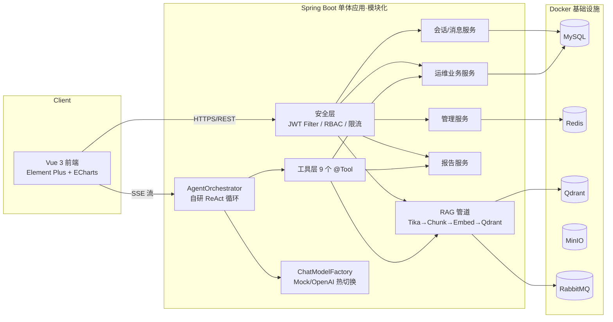
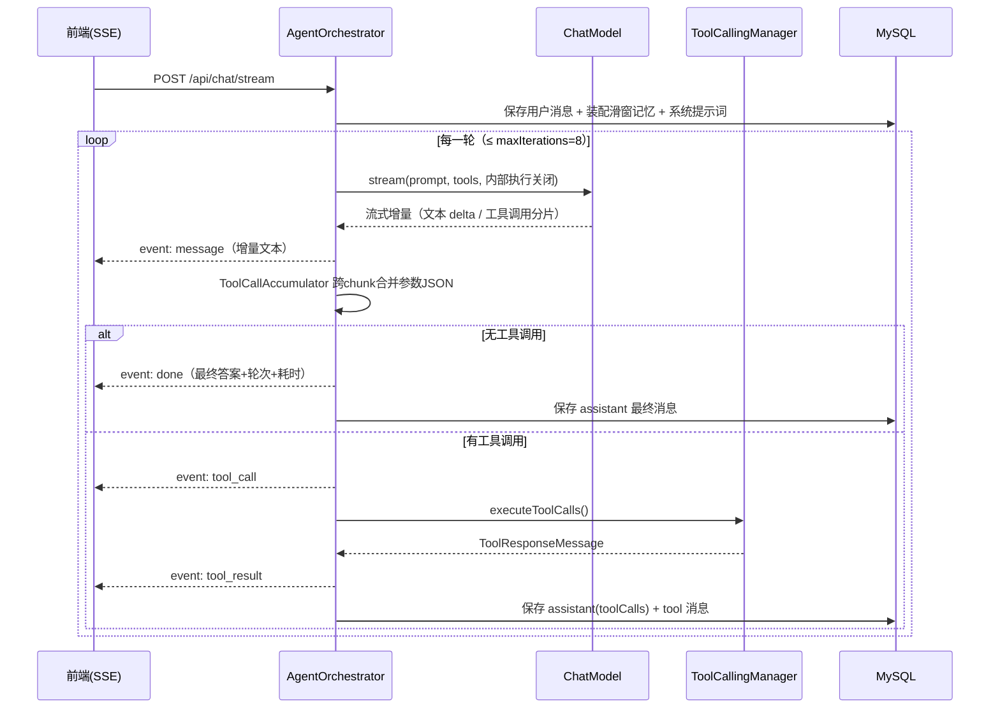
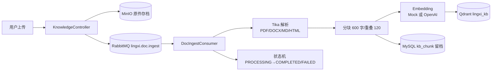
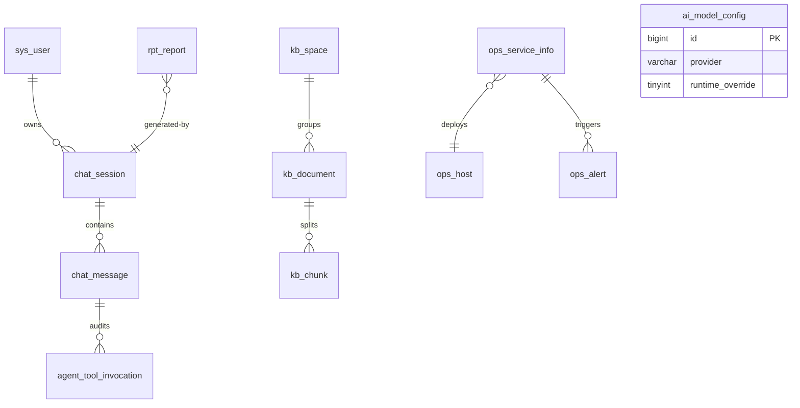
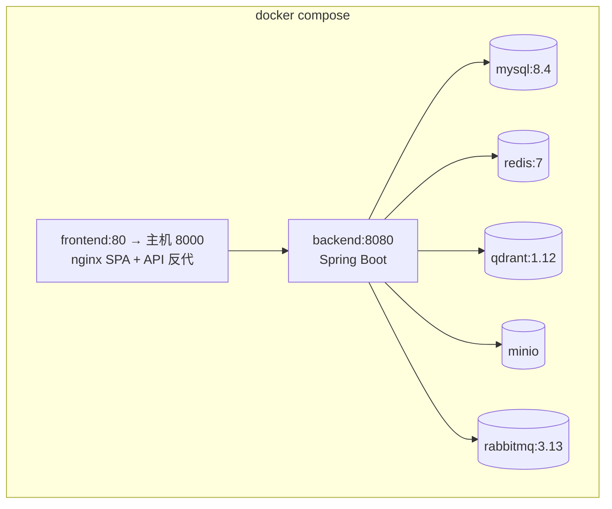

# 灵犀智能体平台（LingXi AI Agent Platform）设计报告

| 项目名称 | 灵犀智能体平台（LingXi AI Agent Platform） |
|---|---|
| 版本 | v1.0.0 |
| 日期 | 2026-09-02 |
| 技术栈 | Java 21 · Spring Boot 3.5 · Spring AI 1.0 · Vue 3 · Docker Compose |
| 配套文档 | 《测试报告》（docs/测试报告.md）、README.md |

---

## 1. 项目概述

### 1.1 项目背景与定位

大模型能力的价值需要通过"**能调用工具、能衔接企业数据、能交付业务结果**"的 Agent 形态落地。本项目构建一个**企业级 AI 智能体平台**，把 Agent 推理引擎、RAG 知识库、工具调用、多智能体协作、对话管理与业务系统整合为一个可一键部署的完整工程，而不是一个调用 Chat API 的 Demo。

项目内置演示场景为 **AIOps 智能运维助手**：平台预置 CMDB（服务/主机资产）、告警、24 小时指标时序数据与 4 篇运维处置手册（Runbook）知识库，用户可以让 AI 完成"告警诊断 → 指标观察 → 手册匹配 → 处置建议"的完整闭环，也可以让 AI 生成巡检报告、执行只读数据分析。

### 1.2 设计目标

1. **可演示**：内置离线 Mock 大模型与 Mock 向量化模型，无任何 API Key 即可跑通全部链路（含多轮工具调用）。
2. **可切换**：LLM 通过 OpenAI 兼容协议接入（DeepSeek / 通义千问 / OpenAI），管理端支持运行时热切换与连通性测试。
3. **可观测**：Agent 每一轮"思考 → 工具调用 → 工具结果"通过 SSE 实时透出到前端，过程可见、可审计。
4. **可测试**：核心逻辑（分块、检索、工具护栏、编排循环、JWT）均以纯函数或可注入依赖实现，测试覆盖率纳入交付。
5. **可部署**：`docker compose up -d --build` 一键拉起 6 个基础设施服务 + 前后端应用。

### 1.3 演示场景剧本

| 剧本 | 用户输入 | Agent 行为 |
|---|---|---|
| 故障诊断 | "订单服务 CPU 告警，帮我诊断一下" | 查询活跃告警 → 查询服务指标 → 检索处置手册 → 输出根因分析与分步处置方案 |
| 数据分析 | "统计各服务当前活跃告警数量" | 生成只读 SQL → 执行白名单校验 → 输出统计表格与解读 |
| 知识问答 | "磁盘空间不足的处置手册是什么" | RAG 检索知识库 → 带来源引用回答 |
| 巡检报告 | "帮我生成巡检报告" | 汇集告警/知识库素材 → 生成 Markdown 报告 → 调用 save_report 落库 → 报告中心可查看下载 |
| 一键诊断 | 运维中心点击"AI 诊断" | 后端为告警自动创建诊断会话并注入结构化提问，前端跳转对话页自动发送 |

---

## 2. 需求分析

### 2.1 功能需求

| 编号 | 模块 | 需求 | 优先级 |
|---|---|---|---|
| FR-01 | 认证 | 用户注册/登录/刷新令牌/获取当前用户，BCrypt 密码存储 | P0 |
| FR-02 | 对话 | SSE 流式对话、多会话管理、历史消息回放、会话删除 | P0 |
| FR-03 | Agent | 多智能体（总控 + 4 领域专家）路由，ReAct 多轮工具调用 | P0 |
| FR-04 | 工具 | 知识库检索/告警/指标/CMDB/只读SQL/联网搜索(模拟)/报告保存/通知/时间 9 类工具 | P0 |
| FR-05 | RAG | 文档上传（MD/TXT/PDF/DOCX）、异步解析分块向量化、检索测试 | P0 |
| FR-06 | 运维 | 告警列表/筛选/分页、CMDB 服务与主机、指标时序图、一键 AI 诊断 | P0 |
| FR-07 | 报告 | AI 报告落库、报告中心列表/查看/下载 Markdown | P1 |
| FR-08 | 仪表盘 | 告警统计与趋势、智能体使用分布、平台概况（Redis 缓存） | P1 |
| FR-09 | 管理 | 用户管理（角色/禁用）、模型配置热更新与连通性测试 | P1 |
| FR-10 | 安全 | JWT 双令牌、RBAC（ADMIN/USER）、接口限流、SQL 只读护栏 | P0 |

### 2.2 非功能需求

| 维度 | 目标 | 实现手段 |
|---|---|---|
| 性能 | 对话首 token < 1s（Mock）；仪表盘接口 < 50ms（缓存命中） | SSE 流式、Redis 30s 缓存、HikariCP 连接池 |
| 可用性 | 依赖服务异常时核心功能不崩溃 | MQ 不可用降级同步摄取、向量库删除失败容忍、统一异常处理 |
| 安全 | 无明文密钥、无 SQL 注入、无 XSS | 环境变量注入、SQL 白名单、DOMPurify、BCrypt |
| 可移植 | 一条命令部署 | docker compose + 多阶段构建 + 健康检查依赖编排 |
| 可维护 | 模块边界清晰 | 按领域分包、依赖注入、持久化抽象（ConversationPersistence） |

---

## 3. 总体架构

### 3.1 架构图



### 3.2 模块划分

```
com.lingxi
├── common        通用层：Result 统一响应、全局异常、限流注解与拦截器
├── config        配置层：Security/MyBatis-Plus/RabbitMQ/Jackson/OpenAPI/种子器
├── security      认证层：JWT 签发校验、过滤器、登录凭证
├── agent         Agent 域
│   ├── core      编排器、智能体注册表、工具集装配、SSE 事件、持久化抽象
│   ├── llm       模型工厂（Mock/OpenAI 热切换）、模型配置
│   ├── memory    对话记忆（滑窗 + 字符预算）
│   ├── tools     9 个 @Tool 工具 Bean
│   └── mock      离线脚本化模型 + 离线向量化
├── rag           知识库域：空间/文档/分块、摄取管道、混合检索
├── modules       业务域：auth / user / chat / ops / report / admin
```

**架构决策：单体 + 模块化**。Agent 平台的早期核心是验证推理链路而非水平扩展，单体可保证事务一致性与部署简单性；模块间通过接口与服务层交互，未来可按 `agent/rag/ops` 拆分微服务（演进路线见 §12）。

---

## 4. 技术选型及论证

| 层次 | 选型 | 版本 | 论证（对比项） |
|---|---|---|---|
| 语言/JVM | Java | 21 LTS | 虚拟线程与 ZGC 就绪；生态成熟度高于 Kotlin/Go（AI SDK 生态） |
| 应用框架 | Spring Boot | 3.5.4 | 事实标准；对比 Quinoa/Micronaut：Spring AI 生态完整、团队招募能力强 |
| AI 框架 | Spring AI | 1.0.0 GA | 对比 LangChain4j：与 Boot 自动装配/可观测性集成更深；对比自研：抽象了 ChatModel/ToolCalling/VectorStore 规范接口。选**核心模块手动装配**而非 starter，因平台需要动态构建 ChatModel（运行时切换供应商），避免自动配置与自定义 Bean 冲突 |
| ORM | MyBatis-Plus | 3.5.7 | 国内企业主流，逻辑删除/分页/自动填充开箱即用；对比 JPA：SQL 可控性更好 |
| 向量库 | Qdrant | 1.12 | 单二进制轻量（对比 Milvus 需 etcd+MinIO 三件套）、gRPC 高性能、Spring AI 官方支持 |
| 关系库 | MySQL | 8.4 | 团队熟悉度与运维生态；utf8mb4 支持中文全文 |
| 缓存 | Redis | 7 | 仪表盘缓存 + Lua 原子限流，双用途 |
| 消息 | RabbitMQ | 3.13 | 文档摄取异步化 + 死信兜底；对比 Kafka：任务队列语义更合适，运维更轻 |
| 对象存储 | MinIO | — | 文档原件存档；S3 协议可平滑迁云 |
| 前端 | Vue 3 + Vite + Element Plus + ECharts | — | 组合在国内企业中后台场景成熟度最高；SSE 用 fetch 流解析（EventSource 不支持 POST/自定义头） |
| 部署 | Docker Compose | 2.40 | 单机一键部署；对比 K8s：演示与中小规模场景成本更低 |

---

## 5. AI Agent 核心设计

### 5.1 多智能体体系

| 智能体 | 定位 | 工具子集 |
|---|---|---|
| 全能管家 supervisor | 总控，处理综合问题 | 全部工具 |
| 知识问答 knowledge_qa | RAG 问答 | 知识库检索、时间 |
| 运维诊断 ops_diagnosis | 告警根因分析与处置 | 告警、指标、CMDB、知识库、时间 |
| 数据分析 data_analysis | 业务数据统计 | 只读 SQL、时间 |
| 报告撰写 report | 巡检/诊断报告 | 知识库、告警、指标、CMDB、报告保存、时间 |

每个智能体 = **系统提示词人设 + 工具子集 + 会话记忆**三元组，由 `AgentRegistry` 注册、`AgentToolSet` 通过 `MethodToolCallbackProvider` 动态装配为 Spring AI `ToolCallback`。

### 5.2 自研 ReAct 编排循环（核心）

Spring AI 默认的"内部工具执行"对调用方是黑盒，无法把推理过程实时透出。本平台关闭内部执行（`internalToolExecutionEnabled=false`），由 `AgentOrchestrator` 手工驱动循环：



关键技术点：

1. **流式工具调用分片合并**（`ToolCallAccumulator`）：OpenAI 流式协议下首片携带工具 id/name、后续片仅含参数增量。累加器采用"出现身份即开启新分片，无身份分片追加到最近分片"策略，兼容 Mock 与真实模型。
2. **SSE 事件协议**（前后端契约）：

| 事件 | data 结构 | 语义 |
|---|---|---|
| start | `{agent, agentName, sessionId, messageId}` | 推理开始，携带会话 ID |
| message | `{delta}` | 增量文本 |
| tool_call | `{calls:[{id,name,arguments}]}` | 模型发起工具调用 |
| tool_result | `{results:[{id,name,responseData}]}` | 工具执行结果 |
| done | `{answer, rounds, costMs}` | 推理完成 |
| error | `{message}` | 失败终止 |

3. **记忆策略**：滑窗 20 条 USER/ASSISTANT 消息 + 24000 字符预算（超限丢弃最旧）；工具轮次消息按轮次持久化，供前端回放与审计。
4. **护栏**：最大 8 轮迭代防死循环；单轮流式读取 120s 超时；工具结果入库前截断。

### 5.3 工具设计

工具以 `@Tool`/`@ToolParam` 注解声明，描述词写法直接影响模型调用准确率，统一遵循"能力 + 参数语义 + 返回格式"三段式描述。安全类工具重点设计：

- **run_readonly_sql（SQL 只读护栏）**：单条语句校验、禁 DML/DDL 关键字（词边界匹配避免误伤 `created_at`）、禁注释、表名白名单（仅 `ops_` 前缀）、自动追加 `LIMIT 100`、JdbcTemplate 5s 查询超时、结果 50 行截断输出 Markdown 表格。
- **search_knowledge_base**：跨空间混合检索，返回带来源标题与相关度的编号片段。
- **send_notification / web_search**：演示模式模拟实现，接口与真实供应商（Tavily、企业 IM Webhook）一致，可平滑替换。

### 5.4 模型接入层（供应商无关）

`ChatModelFactory` 双缓存懒构建 ChatModel / EmbeddingModel：

- `provider=mock`（默认）：`MockChatModel` 脚本化模型 + `MockEmbeddingModel` 词袋向量化。
- `provider=openai`：OpenAI 兼容协议（`OpenAiChatModel`），`base-url` 可指向 DeepSeek / 通义千问兼容模式 / OpenAI。
- 管理端 DB 配置开启 `runtimeOverride` 后覆盖环境变量，保存即 `evict()` 重建实例（热更新）；提供连通性测试接口（Ping 时延）。

### 5.5 Mock 模型设计（可测试性核心）

`MockChatModel` 实现与真实模型完全相同的 `ChatModel` 接口（含流式接口），内部由 `ScriptLibrary` 驱动：

1. **意图识别**：正则关键词路由到 OPS/DATA/REPORT/KB/CHAT 五类剧本；
2. **多轮脚本**：每类剧本定义工具调用序列（如 OPS = query_alerts → query_metrics → search_knowledge_base → 最终诊断），按"工具应答轮数"推进；
3. **流式仿真**：最终答案按 64 字符分片、15ms 间隔下发；工具调用参数 JSON 拆 3 片（首片带 id/name）下发，**用于验证累加器的真实合并路径**；
4. **回答合成**：最终回答引用各工具返回数据（截断嵌入），保证演示输出的真实性。

该设计使平台在离线状态下具备**与真实模型一致的链路行为**，是自动化测试（38 个后端用例）与无 Key 演示的基础。

---

## 6. RAG 知识库设计

### 6.1 摄取管道



设计要点：

- **异步 + 死信**：摄取走 RabbitMQ 队列（quorum queue + DLQ），重试 3 次后进死信；MQ 不可用时**降级为同步摄取**保证功能可用。
- **确定性向量 ID**：`vectorId = UUID(docId-chunkIndex)`，重灌幂等、删除精确（先查 kb_chunk 再按 ID 批量删 Qdrant 点）。
- **状态机**：文档状态 PROCESSING → COMPLETED / FAILED（错误信息落库），前端 3s 轮询刷新。

### 6.2 分块策略

段落贪心聚合（目标 600 字符）+ 尾部 120 字符重叠保上下文连续；超长单段按句子边界（。！？；.）二次切分；纯函数实现，20+ 断言覆盖（短文/空文/长文/无换行超长段）。

### 6.3 混合检索

向量召回（topK×3 候选，阈值 0.05）→ 空间过滤 → 混合重排：

```
finalScore = 0.7 × semantic + 0.3 × lexical
semantic = 1 − distance        （Spring AI 约定 distance 为距离，越小越相似）
lexical  = |bigram(query) ∩ bigram(content)| / |bigram(query)|
```

语义分负责"意思相近"，词面分负责"关键术语精确命中"（运维场景的专有名词如 `jstack`、`activedefrag`），实测两路互补显著降低专有名词漏检率。

### 6.4 离线向量化（MockEmbeddingModel）

512 维 char-bigram + 词元哈希词袋向量，L2 归一化。中文连续文本 bigram 重叠度高，可在完全离线条件下支撑演示级相似检索（混合检索中的词面分弥补语义精度）。接入真实 Embedding API 后自动切换。

---

## 7. 数据库设计

### 7.1 ER 概览（12 张表）



### 7.2 表清单

| 域 | 表 | 说明 | 关键设计 |
|---|---|---|---|
| 身份 | sys_user | 用户 | BCrypt、@TableLogic 软删、唯一索引 username |
| 对话 | chat_session / chat_message | 会话/消息 | role=user/assistant/tool；tool_calls_json 留存工具调用明细供回放审计；session_id 索引 |
| 对话 | agent_tool_invocation | 工具调用审计 | 预留（当前以 chat_message 承载） |
| 知识 | kb_space / kb_document / kb_chunk | 空间/文档/分块 | 文档状态机 + error_message；chunk.vectorId 关联 Qdrant 点 |
| 运维 | ops_host / ops_service_info / ops_alert / ops_metric | CMDB/告警/指标 | started_at 索引支撑趋势聚合；(service_name, collected_at) 复合索引 |
| 平台 | ai_model_config / rpt_report | 模型配置/报告 | 配置单行热更新；报告 MEDIUMTEXT 存 Markdown |

迁移由 **Flyway** 管理（V1 身份对话 → V2 知识 → V3 运维 → V4 平台），演示数据由幂等 `DemoDataSeeder` 写入（账号/CMDB/告警/48 个采集点×8 服务/4 篇 Runbook 知识库）。

---

## 8. API 设计

REST 风格，统一前缀 `/api`，统一响应 `Result<T>{code,message,data,success,timestamp}`（code=0 成功，Long 序列化为字符串防 JS 精度丢失）。完整交互文档见运行时 Swagger（`/swagger-ui.html`），摘要如下：

| 分组 | 端点 | 方法 | 说明 |
|---|---|---|---|
| 认证 | /api/auth/register / login / refresh / me | POST/POST/POST/GET | 双令牌；login/register 限流 |
| 智能体 | /api/agents | GET | 智能体清单 |
| 对话 | /api/chat/sessions（CRUD）、/sessions/{id}/messages | — | 会话与消息 |
| 对话 | /api/chat/stream?sessionId&agentType | POST(SSE) | 流式推理，限流 30 次/分钟 |
| 知识 | /api/kb/spaces、/documents（upload/download/delete）、/search | — | 上传走 multipart，异步摄取 |
| 运维 | /api/ops/alerts、/alerts/{id}/diagnose、/hosts、/services、/metrics | — | 一键诊断返回 sessionId+预置提问 |
| 报告 | /api/reports、/reports/{id} | GET | 分页/详情 |
| 仪表盘 | /api/dashboard/summary | GET | Redis 缓存 30s |
| 管理 | /api/admin/users、/model-config（GET/PUT/test） | — | 仅 ADMIN |

---

## 9. 安全设计

| 威胁 | 对策 |
|---|---|
| 凭证泄露 | BCrypt（强度 10）存储；JWT HS256 双令牌（access 2h / refresh 7d），类型声明防混用；密钥环境变量注入 |
| 越权 | RBAC 两级角色；会话/资源归属校验（非本人且非管理员返回 403）；`/api/admin/**` 网关层拦截 |
| 暴力破解 | Redis Lua 原子计数限流：登录 5 次/分钟/IP（XFF 感知）、对话 30 次/分钟/用户 |
| SQL 注入 / 越权查询 | SQL 工具五重护栏（见 §5.3）；业务查询全部走 MyBatis-Plus 参数化 |
| XSS | 前端 `html:false` 渲染 + DOMPurify 消毒；后端不渲染富文本 |
| 文件风险 | 上传类型白名单提示 + 30MB 限制 + Tika 解析（不执行任何宏）；原件隔离存 MinIO |
| 密钥管理 | API Key 掩码返回（`sk-x****xxxx`）；`.env` 不入库；JWT 生产强制替换提示 |
| 审计 | 工具调用明细、轮次、耗时全量入库；Actuator 暴露 Prometheus 指标 |

---

## 10. 部署设计

### 10.1 拓扑与依赖编排



- **健康检查链**：backend 依赖 5 个基础设施 `service_healthy` 才启动（mysqladmin/redis-cli/6333 端口/mc ready/rabbitmq-diagnostics）；应用自身 `HEALTHCHECK` 探测 `/actuator/health`。
- **多阶段构建**：后端 `maven:3.9-temurin-21` 构建 → `temurin-21-jre-alpine` 运行（非 root 用户）；前端 node:20 构建 → nginx:1.27 运行。
- **SSE 代理**：nginx `/api/` 路由关闭 `proxy_buffering`，读超时 1 小时，保证流式对话不被缓冲截断。
- **可选监控 profile**：`docker compose --profile monitoring up -d` 追加 Prometheus（抓取 `/actuator/prometheus`）+ Grafana（预置数据源）。
- **资源预算**：单机 4C8G 可运行（backend JVM 1G 上限、MySQL/Redis/Qdrant/MinIO/RabbitMQ 均为默认轻载配置）。

### 10.2 配置策略

环境变量唯一入口（12 Factors）：`LLM_PROVIDER`、`OPENAI_*`、`MYSQL_*`、`JWT_SECRET` 等；`.env.example` 提供模板；运行时变更走管理端 DB 配置热覆盖，两级配置优先级明确。

---

## 11. 可观测性设计

- **指标**：Micrometer + Prometheus（HTTP QPS/延迟、JVM、Hikari 连接池、自定义 Agent 轮次耗时）。
- **日志**：SLF4J 分级（Agent 执行、摄取管道、限流触发均有结构化关键日志）。
- **业务观测**：Agent 全过程事件（message/tool_call/tool_result/done）落库 + 前端实时渲染，会话页即"推理现场"。

---

## 12. 风险与演进路线

| 风险 | 应对/演进 |
|---|---|
| 真实模型工具调用不稳定 | 工具描述持续打磨 + maxIterations 护栏 + 失败降级文案；引入工具调用评测集回归 |
| Qdrant 单点 | 演进为 Qdrant 集群或云托管；vectorId 确定性设计已支持任意重建 |
| 单体瓶颈 | 模块边界已隔离，优先拆 agent-executor（有状态推理）与 rag-worker（重 IO）两个服务 |
| 记忆只覆盖会话内 | 演进长期记忆：事实抽取 + 向量化入 Qdrant，跨会话召回 |
| 权限粒度粗 | 预留 sys_role 表设计；引入数据级空间授权（kb_space.owner 已具备） |
| 安全 | 接入真实搜索/通知渠道时增加密钥托管（Vault/云 KMS）与出网白名单 |

---

## 附录 A：演示数据说明

- 账号：`admin/admin123`（管理员）、`opsuser/user123`（普通用户）。
- CMDB：12 台主机、8 个服务（含负责人与核心等级）。
- 告警：6 条活跃（P1×2 / P2×2 / P3×2）+ 18 条近 7 天历史告警（已恢复）。
- 指标：8 服务 × 48 采集点 × CPU/内存两指标（含订单服务近 1 小时 CPU 飙高剧本数据）。
- 知识库：内置"运维手册库"空间 + 4 篇 Runbook（CPU/磁盘/连接池/Redis）。
